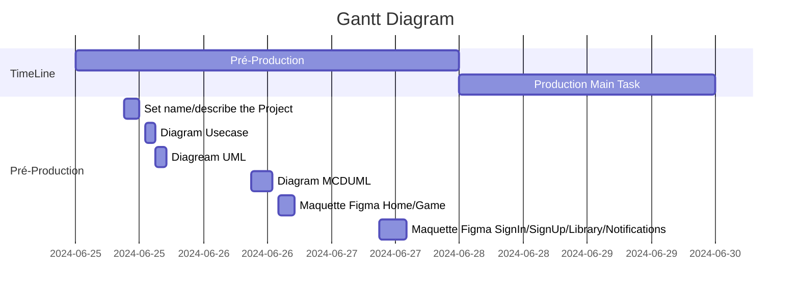

# Playforge
PlayForge est un site de partage et d'achat de jeu indépendant.

## SYSTEME DE NOTIFICATION : 

Mise à Jour d'un jeu de la Bibliothèque

Mise en ligne d'un jeu d'une catégorie likée 

Nouveaux Commentaires/Développeurs

Promo sur certains jeux

## SYSTEME DE BIBLIOTHEQUE :
- stockage des jeux téléchargés 
- stockage pendant une durée de 1 semaine des jeux supprimés
- stockage et récalpitulatif des jeux payés
- jeux souhaités ? (possibilité d'ajouter les jeux télécharger dans une collections)

## SYSTEME DE LOG :
- profil / signIn / signUp 
- modification de profil (photo/name/description)
- obtention des rôles (Développeurs/Utilisateurs)

## Roles :
- Users : classe parent qui permet d'acceder aux download / commentaires / bibliotheque / notifications
- Développeurs : possibilités d'upload mais vérification necessaires par carte d'identitée et paiement de 5€ ?? 
- Admin : contrôle total

## SYSTEME D'UPLOAD ET DE DOWNLOAD :

- possibilité d'upload des fichiers
- possibilité de Download des fichiers 

## SYSTEME DE COMMENTAIRES/NOTES : 

- espace commentaires sous chaque jeux
- notation des jeux par des Users et/ou developpeurs

# UML

## Diagramme UseCase

https://app.diagrams.net/?tags=%7B%7D&lightbox=1&highlight=0000ff&edit=_blank&layers=1&nav=1&title=playforge.drawio#R%3Cmxfile%3E%3Cdiagram%20name%3D%22Page-1%22%20id%3D%22qGl7KstBWzUXytD_VmfC%22%3E5Vxbc6M2FP41nmkfkkHceUycS6fddjLN7OzuowwKVhcjV8iJ3V9fyUgYgdcmWWPE%2BCUBIQSc7%2Bg7N8kTZ7pYP1K4nP9JEpRNbCtZT5y7iW3bgQv4P9GyKVuAZYVlS0pxItt2Dc%2F4P6Q6ytYVTlChdWSEZAwv9caY5DmKmdYGKSVvercXkulPXcIUtRqeY5i1W7%2FghM3L1tAOdu2%2FIZzO1ZOBH5VXFlB1ll9SzGFC3mpNzv3EmVJCWHm0WE9RJqSn5FLe9%2FCDq9WLUZSzLjc8h09%2FxPbme3r3F34g9OHr4nd6BVz5cmyjvpiSVZ4gcZM1cW4JZXOSkhxmnwhZ8kbAG%2F9BjG0kVnDFCG%2Bas0Umr%2FL3oZuv4v5rG3iq4du2IfKrHndr%2BYjybFM%2Fe0IULxBDVDa2v1V%2BfkFWNEaHPlDqDKQpYgf6OWU%2FlGjqICX5iAh%2FG7rhHSjKIMOvunZAqWRp1W%2BHAz%2BQULwHFq9PWHRIvCOA9C97NddNEb5%2FeuH3L8TILBkGl6TArlmyDy9J9p5Zso8uSfa%2BUbKvHK2LkH1gluzBJck%2BNEv29iXJHpzcU9%2FeekMp3NQ6LAnOWdHCphr%2FJ%2BC6KN%2FeNss3si%2FKN7LNMhJy3FeYreSTPhc8xG8CUszhUhyuFtlNzAjlonpFlOGYYwJnKHsiBWaY5LzLjDBGFrUONxlOxQUmsKuDRFYswzmaVmmigwiI4dD6oMjk1crrkAkuX52%2F7bJFjmya1xJFvtWXhreE%2FJTBzQvhqnJI0g8ULvjh7dscM%2FS8hFv9e6OwIcYtLSJ6%2F4oEO5ZSpChe0YJrz9%2BoKOeIaI1JziCXOJV3xiTL4LLAs0z1UBICljirhOOcCJkqhSiRidrABPuQASDsCxunhc3E9jP%2B3NtiCXMNG%2F%2FflUgM3r5wMV6VYr3hHYC7XG%2FFY81g%2FD3dctcVF62YJeI6TWe%2F2C4nOf6Clu1G8sCzft3epUblR6n4fysSpFwvrEeOfqFehn9b%2BT5lp5ba8C%2FFy6KDtrRRPKiynaF1dWS9NrLA3YNs0BuuTp9W5doO3WYWNThiWxJYzLdPr4Y6nlI9hM1RkxQN5r79HHJua0riPM5WSZssxRtv7Y%2BOE5QWJ0b5VrgtU7TASSLG4DzJ5zHc8Z90Mfng3u3Eu%2BuOiVK31oSpyiDyKZN6pWHfROK6FbmhNpkk4O%2FznhfrJ%2FExtS7k5aXgitCD%2FxyZRqI3ScIvp8J%2BiuIU%2F5PhGYVCPCPh08pDUYTqD82oXh%2F5hDVmlZvOj7%2FVjnc0Kk60WtTXOot%2Bq5904d4T06yiz7HFXV7bLTWfZ70f%2BZzv5tkr6xoAhd1YiBa03dVPJMW5efzlKblJ0TqqfjoYf9ltv2JKEWTCRMA45lTGzBMjaMSylVk4Jkbf60mMbg%2BlWGUGQN0MlMma44bAuva5P%2FDOJQ1nd8bDjkaip1zqjqSUfxG5mmIBYDU0pvwkedtOaVojuY4%2BkhM1ZnD5za2BTsWJbjBCO6Zm0UnsmBdEgQaBymqYa8jsNmjKNReRQaeQIZQhQyuDstpI57%2BePimHNdXdB77O88AKooHtZdtcDhzUiaTpLqoTTo812ybL6GiiOuB4Osz7zHlw1qjuXOb8oDHvMz7zDLO8gaVPdaeZ2%2B7ZXnpjtJfeKe2la%2Ft63Ke4zlx76ZlGxlOyWGwLTmWhYjQMXHmnEvowGDqv5psG7edlRmAyNmDtBrD%2B4CWoH7u4AwF7n2DBVmWF33qi5AVn4wEYeDrA7uAZ8dA0gMuyx2Ot7DGFlI0GYbeBcDQ4N7t9rE16t3e8fzXTkDUPFb6PbFmm2y5Umu%2F6Kh08RWnZsoDpnq7bx8INVWa8juxAyzGLPHnnwPRj81CM13NyuetsPFtyubGAwfU%2BmFv2Qz1Qc0JbH6jvWLlt4kdAGCdbiyJqpH6oF%2FLMJ5Ae1yl8sEDlhKHGGJyH3SOscfYClW8ch%2Bg1jfCj9Skn1Ac6e31K%2BcGj4pBTrrNwHd%2FXIFBKaS6JOOdy%2FLuTiLZtf9AFT5ZpVNFYJBF8mCoaVbhzU4UzxvjEOWV8Evr6YgLjicLbt4Ggv%2FjFq3PH6Jijcynu5L8%2BsX%2B%2Be41FtpH9QeKI%2FGZusvEufccpYyQO76Rxius11sAYH6goLTcnf3xH3vIx1n6cxu6jYPDaD2hvrLxZsfkzoq84Prjrz%2Fz9lcBqbOOz9%2BTpz7vBst%2FNXlHk1y0oj%2BejI0a0Y8DeeXPxcDvxfw6XPhYX7d0A0uvW7pFurAftxMMzo3g5cvqJGoV%2BAKyB6Uc9bORqbndV83P9hAE%2F3f0WY%2Bl17X7S0rn%2FHw%3D%3D%3C%2Fdiagram%3E%3C%2Fmxfile%3E

## Gantt Diagram



## Entity Relation Diagram UML

````mermaid
---
title : Diagramme UML
---
 erDiagram
 
Game
Category
Cart
User
Role

Game{
id INT
price DECIMAL
name STRING
image URL
}

Category{
id INT
name STRING
updatedAt Date
}

Cart{
id INT
}

User{
id INT
name STRING
surname STRING
username STRING
email STRING
password STRING
}

Role{
id INT 
}


User }|--|{ Game : library
User }|--|{ Game : comments
User }|--|{ Game : order
User }|--|{ Game : upload


Category }|--|{ Game : has

Game }|--|{ Cart : contains
Cart ||--|| User : has

User }|--|| Role : has

````


## Entity Relation Diagram MCDUML

````mermaid
--- 
title : Diagramme MCDUML
---
 erDiagram
 
Game
Category
Cart
User
Role

Game{
id INT
price DECIMAL
name STRING
description TEXT
image URL
}

Category{
id INT
name STRING
updatedAt Date
}

Cart{
id INT
}

User{
id INT
name STRING
surname STRING
username STRING
email STRING
password STRING
}

Role{
id INT 
}

CategoryGame["CategoryGame"]{
categoryId INT
gameId INT

    }

Upload["Upload"]{
userId INT
gameId INT
    }

Comments["Comments"]{
title TEXT
body TEXT
note INT
    }

Library["Library"]{
userId INT
gameId INT
    }

Order["Order"]{
userId INT
gameId INT
    }

User ||--|{ Comments : comments
Comments }|--|| Game : commented

User ||--|{ Library : has
Library }|--|| Game : contains

User ||--|{ Upload : has
Upload }|--|| Game : has


Category ||--|{ CategoryGame : has
Game ||--|{ CategoryGame : belongs

Game }|--|{ Cart : contains
Cart ||--|| User : has


User ||--|{ Order : order
Order }|--|| Game : ordered

User }|--|| Role : has


````
