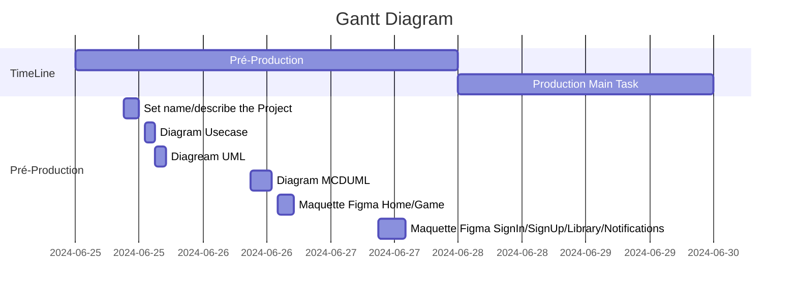

# Playforge
PlayForge est un site de partage et d'achat de jeu indépendant.

## SYSTEME DE NOTIFICATION : 

Mise à Jour d'un jeu de la Bibliothèque

Mise en ligne d'un jeu d'une catégorie likée 

Nouveaux Commentaires/Développeurs

Promo sur certains jeux

## SYSTEME DE BIBLIOTHEQUE :
- stockage des jeux téléchargés 
- stockage pendant une durée de 1 semaine des jeux supprimés
- stockage et récalpitulatif des jeux payés
- jeux souhaités ? (possibilité d'ajouter les jeux télécharger dans une collections)

## SYSTEME DE LOG :
- profil / signIn / signUp 
- modification de profil (photo/name/description)
- obtention des rôles (Développeurs/Utilisateurs)

## Roles :
- Users : classe parent qui permet d'acceder aux download / commentaires / bibliotheque / notifications
- Développeurs : possibilités d'upload mais vérification necessaires par carte d'identitée et paiement de 5€ ?? 
- Admin : contrôle total

## SYSTEME D'UPLOAD ET DE DOWNLOAD :

- possibilité d'upload des fichiers
- possibilité de Download des fichiers 

## SYSTEME DE COMMENTAIRES/NOTES : 

- espace commentaires sous chaque jeux
- notation des jeux par des Users et/ou developpeurs

# UML

## Diagramme UseCase

https://app.diagrams.net/?tags=%7B%7D&lightbox=1&highlight=0000ff&edit=_blank&layers=1&nav=1&title=playforge.drawio#R%3Cmxfile%3E%3Cdiagram%20name%3D%22Page-1%22%20id%3D%22qGl7KstBWzUXytD_VmfC%22%3E5Vxbc6M2FP41nmkfkkHceUycS6fddjLN7OzuowyKrS5GrpATu7%2B%2BEkgYgdcmWWPE%2BMkghIDzHX3nJnniTJebRwpXiz9JgtKJbSWbiXM3sW07cAH%2FES3bsgVYVli2zClOZNuu4Rn%2Fh1RH2brGCcq1joyQlOGV3hiTLEMx09ogpeRN7%2FZCUv2pKzhHrYbnGKbt1i84YYuyNbSDXftvCM8X6snAj8orS6g6yy%2FJFzAhb7Um537iTCkhrDxabqYoFdJTcinve%2FjB1erFKMpYlxuew6c%2FYnv7fX73F34g9OHr8nd6BVz5cmyrvpiSdZYgcZM1cW4JZQsyJxlMPxGy4o2AN%2F6DGNtKrOCaEd60YMtUXuXvQ7dfxf3XNvBUw7eiIfKrHncb%2BYjybFs%2Fe0IULxFDVDa2v1V%2Bfk7WNEaHPlDqDKRzxA70c8p%2BKNHUQUryERH%2BNnTLO1CUQoZfde2AUsnmVb8dDvxAQvEeWLw%2BYdEh8Y4A0r%2Fs1Vw3Rfj%2B6YXfvxAjs2QYXJICu2bJPrwk2XtmyT66JNn7Rsm%2BcrQuQvaBWbIHlyT70CzZ25cke3ByT7249YZSuK11WBGcsbyFTTX%2BT8B1Ub69bZZvZF%2BUb2SbZSTkuK8wXcsnfc55iN8EJF%2FAlThcL9ObmBHKRfWKKMMxxwTOUPpEcswwyXiXGWGMLGsdblI8FxeYwK4OElmzFGdoWqWJDiIghkObgyKTVyuvQya4fHX%2BtssWObJpUUsU%2BVZfGt4S8lMKty%2BEq8ohST9QuOSHt28LzNDzChb690ZhQ4wFLSJ6%2F4oEO5ZSpChe05xrz98oL%2BeIaI1JxiCXOJV3xiRN4SrHs1T1UBICljirhOOcCJkqhSiRidrABPuQASDsCxunhc3E9lP%2B3Nt8BTMNG%2F%2FftUgM3r5wMV6VYr3hHYC72hTisWYw%2Fj4vuOuKi1bMEnGdzme%2F2C4nOf6Clu1G8sCzfi3uUqPyo7n4vRUJUq4X1qNAX74L%2F7Tydco%2BLa3hH4pXeQdlaYN4UGM7I%2BvqwHptYIG7B9igN1idPo3KtR26zSRqcMS0JDBfFE%2BvhjqeUT2EzVGLFA3mvf0ccm5rRuIsTtdJmyvFGxfmR8cJSoMTo6wQbssSLXGSiDE4TfJpDHf0Jz1MPrh3O%2FHuumOi1K01YaoqiHzKpF5o2DeRuG5FbqhNJgn4%2B5zn5eZJfEytC3l5ybki9OA%2BR6Zx6E2S8MvzgkAtPo1tK8UzCoV4RsKnlYOiCNUfmlG9PtIJG8wqL50ff6sd72hUnGilqK91Fv1WP%2BnCvSemWUWfYwu7vLZXaj7Pej9yOd%2FNs1fWNQAKu7EQLWh7q5%2FIHGfm8Zen5CZF66jy6WD8Zbf9iilFkAkTAeOYUxkzT4ygEcpWZuGYGH2vJzG6PVRilRkAdTNQ5mqOGwLr2uf%2BwDtXNJzdGQ87GomeUqk7klL%2BReRqigWA1dCY8pPkbTulaY3kOvpITtSYweU3twY6FSe6wQjtmJpFJ7FjXhAFGgQqqWGuIbPboCnXXEQGnUKGUIYMrQTKeiud%2F7zm7pfDmuruA1%2FneWAF0cD2sm0uBw7qRM50F9UJp8eaFbkyOpqoDjieDvM%2Bcx6cNao7lzk%2FaMz7jM88wyxvYOlT3Wmmtnu2l94Y7aV3Snvp2r4e9ymuM9deeqaR8ZQsl0W9aWR1iso7ldCHwdB5Nd80aD%2BvUgKTsQFrN4D1By9B%2FdjFHQjY%2BwQLtioL%2FNYTJS84HQ%2FAwNMBdgfPiIemAVyWPR5rZY8ppGw0CLsNhKPBudntY2nSu73j%2FYuZhqx5qPB9ZKsy3Xah0nzXV%2BngKUrLlgVM93TdPhZuqDLjdWQHWo5Z5Mk7B6Yfm4divJ6Ty11n49mSy40FDK73wdyyH%2BqBmhPa%2BkB9x8ptEz8CwjjZWhRRI%2FVDvZBnPoH0uE7hgwUqJww1xuA87B5hjbMXqHzjOESvaYQfrU85oT7Q2etTyg8eFYeccp2F6%2Fi%2BBoFSSnNJxDmX49%2BdRLRd%2B4MueLJMo4rGIongw1TRqMKdmyqcMcYnzinjk9DXFxMYTxTevv0D%2FcUvXp07RsccnUtxJ%2F%2Fzif3z3Wssso3sDxJH5Ddzk4136TtOGSNxeCeNU1yvsQbG%2BEBFabk5%2BeM78paNsfbjNHYfBYPXfkB7X%2BXNmi2eEX3F8cFNf%2BZvrwRWYxefvSdPf979lf1u9ooiv25BeTwfHTGiHQP2znuLh9uI%2F3O49LG4aO8GkF53do90Xz1oJx6eGcWrkdNP1Cj0A2ANTD%2FqYSNXc7urmp%2FrHwz46e6vGEuva%2FePls79%2Fw%3D%3D%3C%2Fdiagram%3E%3C%2Fmxfile%3E

## Gantt Diagram



## Entity Relation Diagram UML

````mermaid
---
title : Diagramme UML
---
 erDiagram
 
Game
Category
Cart
User
Role

Game{
id INT
price DECIMAL
name STRING
image URL
}

Category{
id INT
name STRING
updatedAt Date
}

Cart{
id INT
}

User{
id INT
name STRING
surname STRING
username STRING
email STRING
password STRING
}

Role{
id INT 
}


User }|--|{ Game : library
User }|--|{ Game : comments
User }|--|{ Game : order
User }|--|{ Game : upload


Category }|--|{ Game : has

Game }|--|{ Cart : contains
Cart ||--|| User : has

User }|--|| Role : has

````


## Entity Relation Diagram MCDUML

````mermaid
--- 
title : Diagramme MCDUML
---
 erDiagram
 
Game
Category
Cart
User
Role

Game{
id INT
price DECIMAL
name STRING
description TEXT
image URL
}

Category{
id INT
name STRING
updatedAt Date
}

Cart{
id INT
}

User{
id INT
name STRING
surname STRING
username STRING
email STRING
password STRING
}

Role{
id INT 
}

CategoryGame["CategoryGame"]{
categoryId INT
gameId INT

    }

Upload["Upload"]{
userId INT
gameId INT
    }

Comments["Comments"]{
title TEXT
body TEXT
note INT
    }

Library["Library"]{
userId INT
gameId INT
    }

Order["Order"]{
userId INT
gameId INT
    }

User ||--|{ Comments : comments
Comments }|--|| Game : commented

User ||--|{ Library : has
Library }|--|| Game : contains

User ||--|{ Upload : has
Upload }|--|| Game : has


Category ||--|{ CategoryGame : has
Game ||--|{ CategoryGame : belongs

Game }|--|{ Cart : contains
Cart ||--|| User : has


User ||--|{ Order : order
Order }|--|| Game : ordered

User }|--|| Role : has


````
